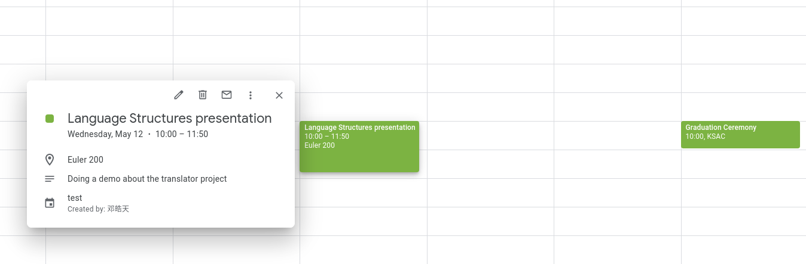

# Project Details

## Note
   This repository is subject to change

## Running the app

```
gradle run
```

This command will produce a file named `parser/test.ics` from the existing input file `parser/test.scl`, which can be imported to any standard calendar software.

## Introduction
The core idea of the project is a human-readable syntax to specify calendar events. It allows user to write and generate calendar events using readable text syntax, without having to interact with a graphical calendar application. The language is primarily designed for efficiently generating schedules that contain repetitive events with common attributes, typically done by incrementally building and reusing different groups of event attributes.

A translator/compiler is implemented to convert a properly structured text defined by this document (`.scl`) into an [iCalendar](https://icalendar.org/iCalendar-RFC-5545/4-icalendar-object-examples.html) (`.ics`) file.

## Features

### Currently supported
* Be able to set one-time events and recurring events.
* Language and syntax are intuitive and easy to construct.
* Flexible way to add properties that span multiple line (e.g. description, location) to a given event.

### Future features
Although the features listed below are currently not implemented, the design should allow an extension to support the following features:
* Explicit time zone specification
* Inheritance through partial events.
* Null fields in sub-events to clear certain field of parent event.
* Have reasonable defaults:
    * unspecified year will default to the current year (e.g. "Mar 1" means "Mar 1, 2021").
    * unspecified event heading will use the event's name.
* Use event attribute generator in recurring schedule (e.g. group leader: Adam, Ben, Cathy, alternating on a weekly recurring small group event).
* Variables support
    * String variables using `var` keyword.
    * String concatenation functionality using `.` operator.
    * String template replacement?
    * Using a visitor to run before the propreader?

## Specifications
### Syntax
The basic syntax is illustrated below, where each `event` keyword defines a new event. Event names has the following form: `[a-z][a-z0-9_]*`

Multiple "attributes" can following the line that declares the event. Values of the attributes are surrounded by angle brackets (`<>`), and values can span multiple lines.

Events are separated by one or more newline character.
```
event event1
attribute1: <value1>
attribute2: <value2>
attribute3: <long value
that spans multiple lines>

event event2
attribute1: <value1>
attribute2: <value2>
```

### Timing attributes
The following are possible event attributes related to time.

| Attribute name | Attribute content            | Example                      |
|----------------|------------------------------|------------------------------|
| from           | a _time_ or a _datetime_ (1) | from: 4:00pm                 |
| to             | a _time_ or a _datetime_ (1) | to: 5:00pm                   |
| spans          | a _duration_ (*)             | spans: 50 minutes            |
| on (2)         | a _date_                     | on: Mar 19                   |
| every (3)      | `[0-9]+` _interval_          | every: 2 weeks               |
| starting (4)   | a _date_                     | starting: Mar 19             |
| scheduled      | a _recurrence spec_ (*)      | scheduled: Nov; week 3; Thur |
| until          | a _date_                     | until: May 13                |
| for            | `[0-9]+ 'times'`             | for: 3 times                 |


* (1): if either is specified as a _datetime_, the `on` attribute will be ignored (a warning can be issued if `on` is also specified). More advanced logic can be implemented in deducing the date of `from` or `to`. For example, if we have `from: Mar 13, 5:00pm` and `to: 1:00am`, then the date of `to` should be deduced as Mar 14.
* (2): for one-time event only.
* (3): the specification of this field turns the event into a recurring event.
* (4): the starting date of a recurring event, the same function as `on` for one-time events.
* (*): See sections below

#### `spans` attribute
To be completed.

#### `scheduled` attribute
The `scheduled` keyword defines a more granular schedule within a repetition period. To use the `scheduled` keyword, the `every` keyword must be specified. If the unit specified in the `every` attribute is "week", then a  _week schedule_ must be used for the `scheduled` keyword; the same rule also applies for "month" and "year."

| Schedule type    | Composition                        | Example            | Meaning                                                  |
| :--------:       | :--------:                         | :--------:         | :-------:                                                |
| _week schedule_  | _weekday spec_                     | `Mon, Wed, Fri`    | Weekly repeat on Monday, Wednesday, and Friday           |
| _month schedule_ | _week spec_ ';' _weekday schedule_ | `week 1,3; Mon`    | Monthly repeat on the first and third week's Monday      |
| _month schedule_ | _day spec_                         | `day 1,2,4,5`      | Monthly repeat on days 1,2,4,5 of the month              |
| _year schedule_  | _month spec_ `;` _month schedule_  | `May; week 1; Sun` | Yearly repeat on the first sunday of May (Monther's day) |
| _year schedule_  | _day spec_                         | `day 1,2,4,5`      | Yearly repeat on days 1,2,4,5 of the year                |

#### Types of _recurrence spec_.
| Spec type               | Composition                                                    | Example         |
| :--------:              | :--------:                                                     | :--------:      |
| _daylist primitive_     | `\d+(, \d+)*`                                                  | `1,2,3,5`       |
| _daylist primitive_     | `\d+ - \d+`                                                    | `10-15`         |
| _weekday primitive_ (1) | `(Mon\|Tue\|Wed\|Thur\|Fri\|Sat\|Sun)`                         | `Mon`           |
| _weekdaylist primitive_ | _weekday primitive_ (`,` _weekday primitive_)*                 | `Mon, Wed, Fri` |
| _month primitive_ (1)   | `(Jan\|Feb\|Mar\|Apr\|May\|Jun\|Jul\|Aug\|Sep\|Oct\|Nov\|Dec)` | `Nov`           |
| _monthlist primitive_   | _month primitive_ (`,` _month primitive_)*                     | `Jan, Nov, Dec` |
| _week spec_             | `week` _daylist primitive_                                     | `week 1,3`      |
| _day spec_              | `day` _daylist primitive_                                      | `day 1,2,3,4,5` |
| _weekday spec_          | _weekdaylist primitive_                                        | `Mon, Wed, Fri` |
| _weekday spec_          | `weekday` _daylist primitive_                                  | `weekday 1,3,5` |
| _month spec_            | _monthlist primitive_                                          | `Jan, Nov, Dec` |
| _month spec_            | `month` _daylist primitive_                                    | `month 1-3`     |

* (1) the full form (e.g. January) or the abbreviated form (e.g. M,W,F) can also be used.


### Informational attributes
The following attributes describes information regarding an event. The value specified will be directly inserted into the event following the iCalendar specification.

| Attribute   | Explanation                                |
| :--:        | :--:                                       |
| summary     | corresponds to the `SUMMARY` attribute     |
| location    | corresponds to the `LOCATION` attribute    |
| description | corresponds to the `DESCRIPTION` attribute |

## Example input/output
sample input:
```scl
event Chorale
every: <1 week>
from: <Mar 1, 2021 4:00pm>
to: <Mar 1, 2021 5:00pm>
until: <May 5, 2021>
summary: <Chorale Rehearsal>
description: <Dr. Spencer hates people being late
and people will be called to his office if they are late>
```

sample output:
```icalendar
BEGIN:VCALENDAR
PRODID:Simple-calendar-language
VERSION:0.1
BEGIN:VEVENT
UID:f01c1858-3599-44cc-9544-bbd439617979
DTSTAMP:20210512T072857Z
SUMMARY:Chorale Rehearsal
DESCRIPTION:Dr. Spencer hates people being late\nand people will be called
 to his office if they are late
RRULE:FREQ=WEEKLY;UNTIL=20210505;INTERVAL=1
END:VEVENT
END:VCALENDAR
```

sample input:
```scl
from: <Sep 2, 1997 9:00>
every: <day>
for: <10 times>
```

sample output:
```icalendar
DTSTART;TZID=America/New_York:19970902T090000
RRULE:FREQ=DAILY;COUNT=10
```

## Demo

### Input file content (test.scl)
```scl
event COS382
summary:		<Language Structures presentation>
description:	<Doing a demo about the translator project>
location:		<Euler 200>
from: 			<May 12, 2021 10:00 AM>
to:   			<May 12, 2021 11:50 AM>

event Church
location: 		<Muncie>
description: 	<Please please please do not be late>
from: 			<May 16, 2021 8:30 AM>
to: 			<May 16, 2021 12:00 PM>
every: 			<1 week>
scheduled:		<U>

event Commencement
summary:		<Graduation Ceremony>
location:		<KSAC>
description:	<Happy graduation!>
from:			<May 15, 10:00 AM>
to:				<May 15, 2:00 PM>
```

### Effect (using Google Calendar import)


