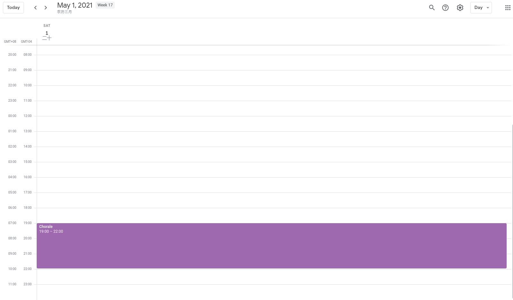

# Project Details

## Running the app
The current state of the app is incomplete, but result can be retrieved by executing:

```
gradle run
```

## Introduction
The core idea of the project is a human-readable syntax to specify calendar events. It allows user to write and maintain events using pure text files, without having to depend on the availability of a graphical calendar application.

A parser and a translator will be implemented to convert the given input into a proper `.ics` file.

## Requirements

* Be able to set one-time events and recurring events.
* Language and syntax should be easy to read.
* Have reasonable defaults:
    * unspecified year will default to the current one (e.g. "Mar 1" means "Mar 1, 2021").
* Be able to define property mixins via partial event inheritance (e.g. start time, repetition, etc.)
* Specify recurring date with human-oriented notation. (e.g. Second Wednesday of February, Last thursday of November)
* Flexible way to add properties (e.g. name, description, location) to a given event.

### Future
* Use event generator in recurring schedule (e.g. group leader: Adam, Ben, Cathy, alternating on a weekly recurring small group event)

## Current milestone

### Input file content (test.scl)
```
event Chorale
from: "May 1, 2021 7:00PM"
to: "May 1, 2021 10:00PM"
```
### Output file content (test.ics)
```
BEGIN:VCALENDAR
VERSION:2.0
PRODID:-//Michael Angstadt//biweekly 0.6.6//EN
BEGIN:VEVENT
UID:1682cb14-0c87-4be7-aed8-b5e038a31767
DTSTAMP:20210428T033910Z
SUMMARY:Chorale
DTSTART:20210501T230000Z
DTEND:20210502T020000Z
END:VEVENT
END:VCALENDAR
```

### Effect (using Google Calendar import)


